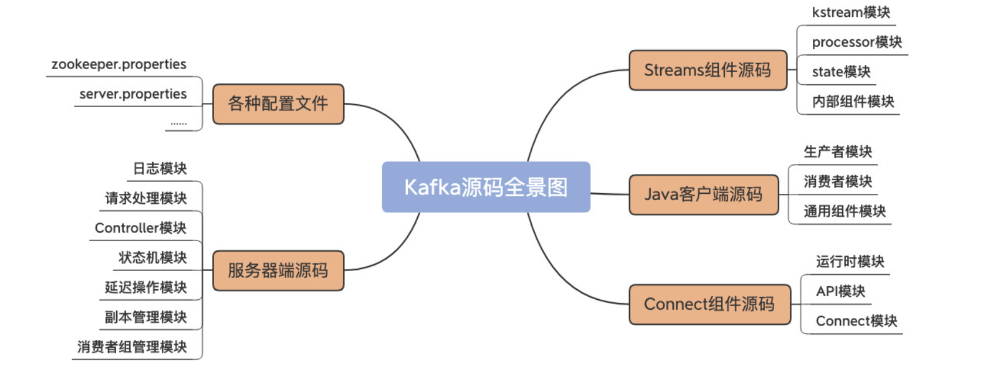
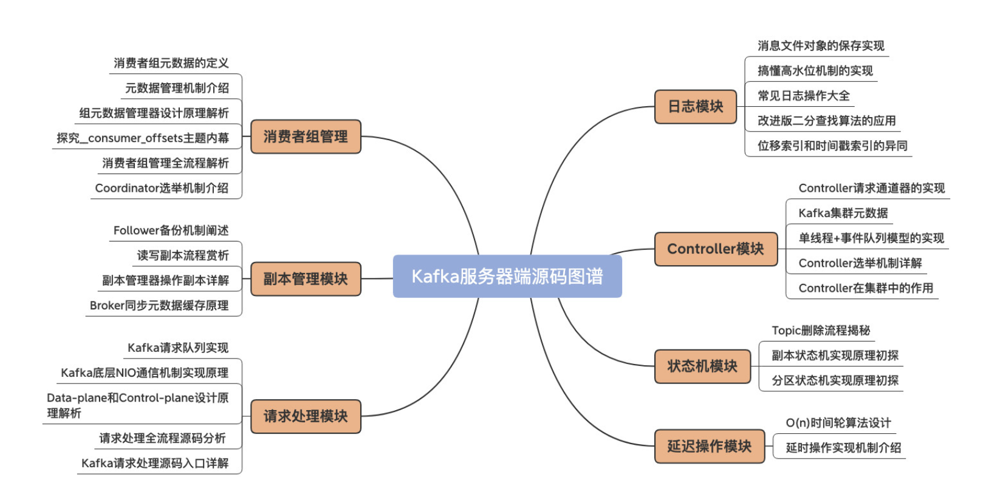

# Explore-kafka

> 本项目基于kafka 3.6.0，源码版本为2023.10的源码版本 ------'KAFKA-15378'（可以在git history中回溯），所以一部分的分析具有一定的版本局限性。

## About Project

本项目是采用**自下而上**、**自上而下**相结合的方式阅读kafka源码的项目笔记。

> - **自上而下（Top-Down）**：从最顶层或最外层的代码一步步深入。通俗地说，就是从 main 函数开始阅读，逐渐向下层层深入，直到抵达最底层代码。这个方法的好处在于，你遍历的是完整的顶层功能路径，这对于你了解各个功能的整体流程极有帮助。
> - **自下而上（Bottom-Up）**：跟自上而下相反，是指先独立地阅读和搞懂每个组件的代码和实现机制，然后不断向上延展，并最终把它们组装起来。该方法不是沿着功能的维度向上溯源的，相反地，它更有助于你掌握底层的基础组件代码。

首先，要确认最小单位的组件。我主要是看Kafka源码中的包结构（package structure），比如controller、log、server等，这些包基本上就是按照组件来划分的。我给这些组件确定的优先级顺序是“log–>network–>controller–>server–>coordinator–>……”，毕竟，后面的组件会频繁地调用前面的组件。

等你清楚地了解了单个组件的源码结构，就可以试着切换成自上而下的方法，即从一个大的功能点入手，再逐步深入到各个底层组件的源码。得益于前面的积累，你会对下沉过程中碰到的各层基础代码非常熟悉，这会带给你很大的成就感。

从功能上讲，Kafka源码分为四大模块。

- 服务器端源码：实现Kafka架构和各类优秀特性的基础。
- Java客户端源码：定义了与Broker端的交互机制，以及通用的Broker端组件支撑代码。
- Connect源码：用于实现Kafka与外部系统的高性能数据传输。
- Streams源码：用于实现实时的流处理功能。

可以看到，服务器端源码是理解Kafka底层架构特别是系统运行原理的基础，其他三个模块的源码都对它有着强烈的依赖。因此，**Kafka最最精华的代码，当属服务器端代码无疑！**

## Directory

[0.quickstart](https://github.com/EricCoderG/explore-kafka/blob/master/quickstart.md)

[1.log](https://github.com/EricCoderG/explore-kafka/blob/master/log.md)
