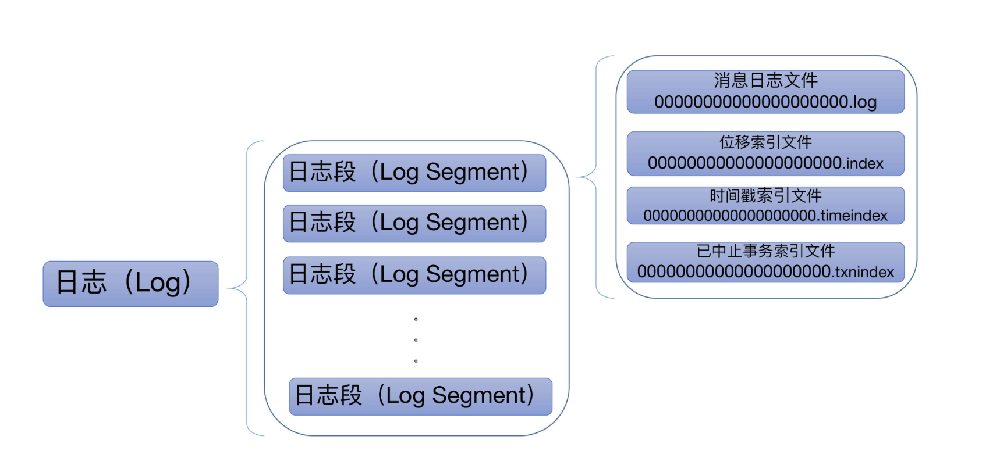
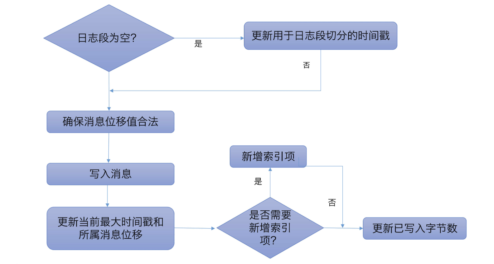
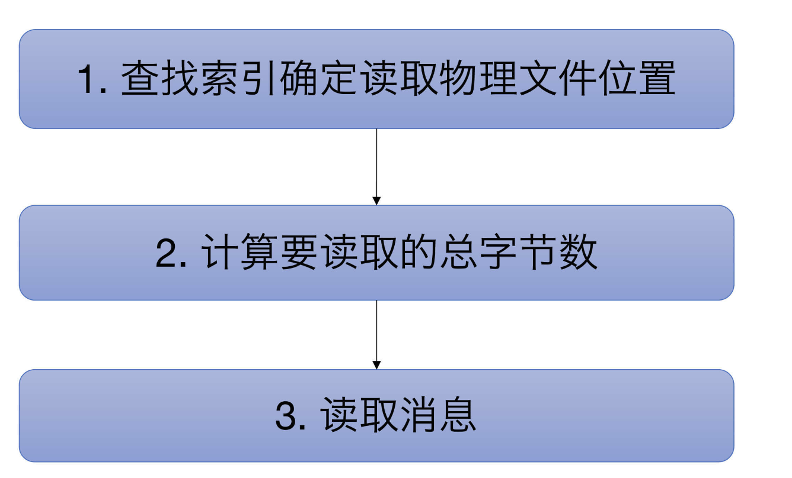
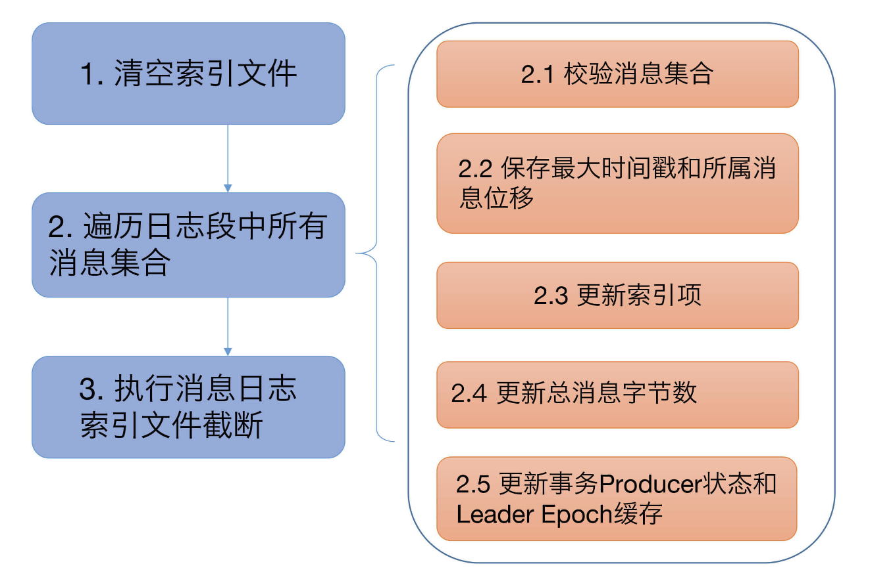
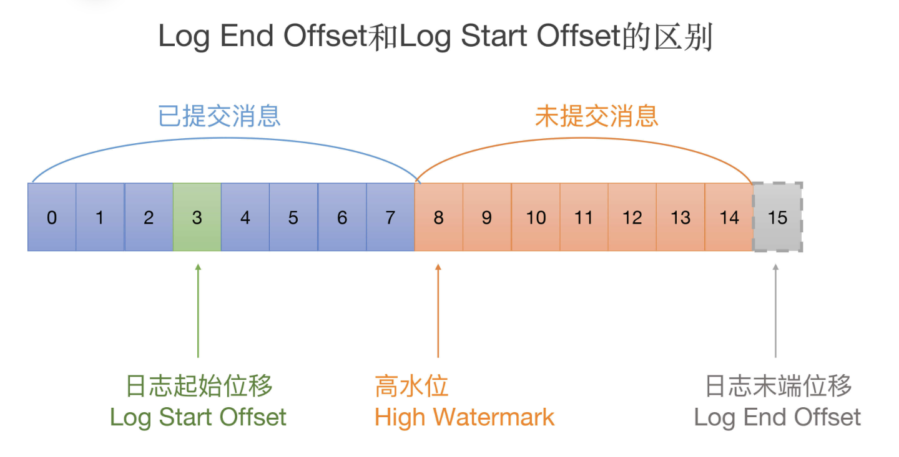

# 1.保存消息文件的对象是怎么实现的？（日志段）

## 日志

Kafka日志在磁盘上的组织架构如下图所示：



日志是Kafka服务器端代码的重要组件之一，很多其他的核心组件都是以日志为基础的。

Kafka日志对象由多个日志段对象组成，而每个日志段对象会在磁盘上创建一组文件，包括消息日志文件（.log）、位移索引文件（.index）、时间戳索引文件（.timeindex）以及已中止（Aborted）事务的索引文件（.txnindex）。当然，如果你没有使用Kafka事务，已中止事务的索引文件是不会被创建出来的。图中的一串数字0是该日志段的起始位移值（Base Offset），也就是该日志段中所存的第一条消息的位移值。

一般情况下，一个Kafka主题有很多分区，每个分区就对应一个Log对象，在物理磁盘上则对应于一个子目录。比如你创建了一个双分区的主题test-topic，那么，Kafka在磁盘上会创建两个子目录：test-topic-0和test-topic-1。而在服务器端，这就是两个Log对象。每个子目录下存在多组日志段，也就是多组.log、.index、.timeindex文件组合，只不过文件名不同，因为每个日志段的起始位移不同。

## 日志段代码解析

日志段是Kafka保存消息的最小载体。

单纯查看官网对该参数的说明，我们不一定能够了解它的真实作用。下面介绍一个实际生产中的例子

> 大面积日志段同时间切分，导致瞬时打满磁盘I/O带宽。对此，所有人都束手无策，最终只能求助于日志段源码。
>
> 最后，我们在LogSegment的shouldRoll方法中找到了解决方案：设置Broker端参数log.roll.jitter.ms值大于0，即通过给日志段切分执行时间加一个扰动值的方式，来避免大量日志段在同一时刻执行切分动作，从而显著降低磁盘I/O。

### 代码位置

`org/apache/kafka/storage/internals/log/LogSegment.java`

> 这个位置是在KAFKA-14481（2023.10.16）移动的，之前一直在core module中，并且之前是.scala，现在为.java

```java
/**
 * A segment of the log. Each segment has two components: a log and an index. The log is a FileRecords containing
 * the actual messages. The index is an OffsetIndex that maps from logical offsets to physical file positions. Each
 * segment has a base offset which is an offset <= the least offset of any message in this segment and > any offset in
 * any previous segment.
 *
 * A segment with a base offset of [base_offset] would be stored in two files, a [base_offset].index and a [base_offset].log file.
 *
 * This class is not thread-safe.
 */
```

这段文字清楚地说明了每个日志段由两个核心组件构成：日志和索引。当然，这里的索引泛指广义的索引文件。另外，这段注释还给出了一个重要的事实：每个日志段都有一个**起始位移值**（Base Offset），而该位移值是**此日志段所有消息中最小的位移值**，同时，该值却又**比前面任何日志段中消息的位移值都大**。看完这个注释，我们就能够快速地了解起始位移值在日志段中的作用了。

### 日志段类声明

```Java
    /**
     * Create a LogSegment with the provided parameters.
     *
     * @param log The file records containing log entries
     * @param lazyOffsetIndex The offset index
     * @param lazyTimeIndex The timestamp index
     * @param txnIndex The transaction index
     * @param baseOffset A lower bound on the offsets in this segment
     * @param indexIntervalBytes The approximate number of bytes between entries in the index
     * @param rollJitterMs The maximum random jitter subtracted from the scheduled segment roll time
     * @param time The time instance
     */
    public LogSegment(FileRecords log,
                      LazyIndex<OffsetIndex> lazyOffsetIndex,
                      LazyIndex<TimeIndex> lazyTimeIndex,
                      TransactionIndex txnIndex,
                      long baseOffset,
                      int indexIntervalBytes,
                      long rollJitterMs,
                      Time time) {
        this.log = log;
        this.lazyOffsetIndex = lazyOffsetIndex;
        this.lazyTimeIndex = lazyTimeIndex;
        this.txnIndex = txnIndex;
        this.baseOffset = baseOffset;
        this.indexIntervalBytes = indexIntervalBytes;
        this.rollJitterMs = rollJitterMs;
        this.time = time;
        this.created = time.milliseconds();
    }

```

这里的 FileRecords 就是实际保存 Kafka 消息的对象。

下面的 lazyOffsetIndex、lazyTimeIndex 和 txnIndex 分别对应于刚才所说的 3 个索引文件。不过，在实现方式上，前两种使用了延迟初始化的原理，降低了初始化时间成本。后面我们在谈到索引的时候再详细说。

每个日志段对象保存自己的起始位移 **baseOffset**——这是非常重要的属性！事实上，你在磁盘上看到的文件名就是baseOffset的值。每个LogSegment对象实例一旦被创建，它的起始位移就是固定的了，不能再被更改。

indexIntervalBytes 值其实就是 Broker 端参数 log.index.interval.bytes 值，它控制了**日志段对象新增索引项的频率**。默认情况下，日志段至少新写入 4KB 的消息数据才会新增一条索引项。而 rollJitterMs 是日志段对象新增倒计时的“扰动值”。因为目前 Broker 端日志段新增倒计时是全局设置，这就是说，在未来的某个时刻可能同时创建多个日志段对象，这将极大地增加物理磁盘 I/O 压力。有了 rollJitterMs 值的干扰，每个新增日志段在创建时会彼此岔开一小段时间，这样可以缓解物理磁盘的 I/O 负载瓶颈。

至于最后的 time 参数，它就是用于统计计时的一个实现类，在 Kafka 源码中普遍出现，我就不详细展开讲了。

### append方法

```Java
    /**
     * Append the given messages starting with the given offset. Add
     * an entry to the index if needed.
     *
     * It is assumed this method is being called from within a lock, it is not thread-safe otherwise.
     *
     * @param largestOffset The last offset in the message set
     * @param largestTimestampMs The largest timestamp in the message set.
     * @param shallowOffsetOfMaxTimestamp The offset of the message that has the largest timestamp in the messages to append.
     * @param records The log entries to append.
     * @throws LogSegmentOffsetOverflowException if the largest offset causes index offset overflow
     */
    public void append(long largestOffset,
                       long largestTimestampMs,
                       long shallowOffsetOfMaxTimestamp,
                       MemoryRecords records) throws IOException {
        if (records.sizeInBytes() > 0) {
            LOGGER.trace("Inserting {} bytes at end offset {} at position {} with largest timestamp {} at shallow offset {}",
                records.sizeInBytes(), largestOffset, log.sizeInBytes(), largestTimestampMs, shallowOffsetOfMaxTimestamp);
            int physicalPosition = log.sizeInBytes();
            if (physicalPosition == 0)
                rollingBasedTimestamp = OptionalLong.of(largestTimestampMs);

            ensureOffsetInRange(largestOffset);

            // append the messages
            long appendedBytes = log.append(records);
            LOGGER.trace("Appended {} to {} at end offset {}", appendedBytes, log.file(), largestOffset);
            // Update the in memory max timestamp and corresponding offset.
            if (largestTimestampMs > maxTimestampSoFar()) {
                maxTimestampAndOffsetSoFar = new TimestampOffset(largestTimestampMs, shallowOffsetOfMaxTimestamp);
            }
            // append an entry to the index (if needed)
            if (bytesSinceLastIndexEntry > indexIntervalBytes) {
                offsetIndex().append(largestOffset, physicalPosition);
                timeIndex().maybeAppend(maxTimestampSoFar(), offsetOfMaxTimestampSoFar());
                bytesSinceLastIndexEntry = 0;
            }
            bytesSinceLastIndexEntry += records.sizeInBytes();
        }
    }

```

append 方法接收 4 个参数，分别表示待写入消息批次中消息的**最大位移值**、**最大时间戳**、**最大时间戳对应消息的位移**以及**真正要写入的消息集合**。下面这张图展示了 append 方法的完整执行流程：



**第一步：**

在源码中，首先调用 log.sizeInBytes 方法判断该日志段是否为空，如果是空的话， Kafka 需要记录要写入消息集合的最大时间戳，并将其作为后面新增日志段倒计时的依据。

**第二步：**

代码调用 ensureOffsetInRange 方法确保输入参数最大位移值是合法的。那怎么判断是不是合法呢？标准就是看它与日志段起始位移的差值是否在整数范围内，即 largestOffset - baseOffset的值是不是介于 [0，Int.MAXVALUE] 之间。在极个别的情况下，这个差值可能会越界，这时，append 方法就会抛出异常，阻止后续的消息写入。一旦你碰到这个问题，你需要做的是升级你的 Kafka 版本，因为这是由已知的 Bug 导致的。

**第三步：**

待这些做完之后，append 方法调用 FileRecords 的 append 方法执行真正的写入。前面说过了，专栏后面我们会详细介绍 FileRecords 类。这里你只需要知道它的工作是将内存中的消息对象写入到操作系统的页缓存就可以了。

**第四步：**

再下一步，就是更新日志段的最大时间戳以及最大时间戳所属消息的位移值属性。每个日志段都要保存当前最大时间戳信息和所属消息的位移信息。

还记得 Broker 端提供定期删除日志的功能吗？比如我只想保留最近 7 天的日志，没错，当前最大时间戳这个值就是判断的依据；而最大时间戳对应的消息的位移值则用于时间戳索引项。虽然后面我会详细介绍，这里我还是稍微提一下：**时间戳索引项保存时间戳与消息位移的对应关系**。在这步操作中，Kafka会更新并保存这组对应关系。

**第五步：**

append 方法的最后一步就是更新索引项和写入的字节数了。我在前面说过，日志段每写入 4KB 数据就要写入一个索引项。当已写入字节数超过了 4KB 之后，append 方法会调用索引对象的 append 方法新增索引项，同时清空已写入字节数，以备下次重新累积计算。

### read方法

下面我们来看read方法，了解下读取日志段的具体操作。

```Java
    /**
     * Read a message set from this segment beginning with the first offset >= startOffset. The message set will include
     * no more than maxSize bytes and will end before maxOffset if a maxOffset is specified.
     *
     * This method is thread-safe.
     *
     * @param startOffset A lower bound on the first offset to include in the message set we read
     * @param maxSize The maximum number of bytes to include in the message set we read
     * @param maxPosition The maximum position in the log segment that should be exposed for read
     * @param minOneMessage If this is true, the first message will be returned even if it exceeds `maxSize` (if one exists)
     *
     * @return The fetched data and the offset metadata of the first message whose offset is >= startOffset,
     *         or null if the startOffset is larger than the largest offset in this log
     */
    public FetchDataInfo read(long startOffset, int maxSize, long maxPosition, boolean minOneMessage) throws IOException {
        if (maxSize < 0)
            throw new IllegalArgumentException("Invalid max size " + maxSize + " for log read from segment " + log);

        LogOffsetPosition startOffsetAndSize = translateOffset(startOffset);

        // if the start position is already off the end of the log, return null
        if (startOffsetAndSize == null)
            return null;

        int startPosition = startOffsetAndSize.position;
        LogOffsetMetadata offsetMetadata = new LogOffsetMetadata(startOffset, this.baseOffset, startPosition);

        int adjustedMaxSize = maxSize;
        if (minOneMessage)
            adjustedMaxSize = Math.max(maxSize, startOffsetAndSize.size);

        // return a log segment but with zero size in the case below
        if (adjustedMaxSize == 0)
            return new FetchDataInfo(offsetMetadata, MemoryRecords.EMPTY);

        // calculate the length of the message set to read based on whether or not they gave us a maxOffset
        int fetchSize = Math.min((int) (maxPosition - startPosition), adjustedMaxSize);

        return new FetchDataInfo(offsetMetadata, log.slice(startPosition, fetchSize),
            adjustedMaxSize < startOffsetAndSize.size, Optional.empty());
    }

```

read 方法接收 4 个输入参数。

- startOffset：要读取的第一条消息的位移；
- maxSize：能读取的最大字节数；
- maxPosition ：能读到的最大文件位置；
- minOneMessage：是否允许在消息体过大时至少返回第一条消息。

前3个参数的含义很好理解，重点说下第 4 个。当这个参数为 true 时，即使出现消息体字节数超过了 maxSize 的情形，read 方法依然能返回至少一条消息。引入这个参数主要是为了确保不出现消费饿死的情况。

下图展示了 read 方法的完整执行逻辑：



逻辑很简单，我们一步步来看下。

第一步是调用 translateOffset 方法定位要读取的起始文件位置 （startPosition）。输入参数 startOffset 仅仅是位移值，Kafka 需要根据索引信息找到对应的物理文件位置才能开始读取消息。

待确定了读取起始位置，日志段代码需要根据这部分信息以及 maxSize 和 maxPosition 参数共同计算要读取的总字节数。举个例子，假设 maxSize=100，maxPosition=300，startPosition=250，那么 read 方法只能读取 50 字节，因为 maxPosition - startPosition = 50。我们把它和maxSize参数相比较，其中的最小值就是最终能够读取的总字节数。

最后一步是调用 FileRecords 的 slice 方法，从指定位置读取指定大小的消息集合。

### recover 方法

下面的代码是 recover 方法源码。什么是恢复日志段呢？其实就是说， Broker 在启动时会从磁盘上加载所有日志段信息到内存中，并创建相应的 LogSegment 对象实例。在这个过程中，它需要执行一系列的操作。

```Java
    /**
     * Run recovery on the given segment. This will rebuild the index from the log file and lop off any invalid bytes
     * from the end of the log and index.
     *
     * This method is not thread-safe.
     *
     * @param producerStateManager Producer state corresponding to the segment's base offset. This is needed to recover
     *                             the transaction index.
     * @param leaderEpochCache Optionally a cache for updating the leader epoch during recovery.
     * @return The number of bytes truncated from the log
     * @throws LogSegmentOffsetOverflowException if the log segment contains an offset that causes the index offset to overflow
     */
    public int recover(ProducerStateManager producerStateManager, Optional<LeaderEpochFileCache> leaderEpochCache) throws IOException {
        offsetIndex().reset();
        timeIndex().reset();
        txnIndex.reset();
        int validBytes = 0;
        int lastIndexEntry = 0;
        maxTimestampAndOffsetSoFar = TimestampOffset.UNKNOWN;
        try {
            for (RecordBatch batch : log.batches()) {
                batch.ensureValid();
                ensureOffsetInRange(batch.lastOffset());

                // The max timestamp is exposed at the batch level, so no need to iterate the records
                if (batch.maxTimestamp() > maxTimestampSoFar()) {
                    maxTimestampAndOffsetSoFar = new TimestampOffset(batch.maxTimestamp(), batch.lastOffset());
                }

                // Build offset index
                if (validBytes - lastIndexEntry > indexIntervalBytes) {
                    offsetIndex().append(batch.lastOffset(), validBytes);
                    timeIndex().maybeAppend(maxTimestampSoFar(), offsetOfMaxTimestampSoFar());
                    lastIndexEntry = validBytes;
                }
                validBytes += batch.sizeInBytes();

                if (batch.magic() >= RecordBatch.MAGIC_VALUE_V2) {
                    leaderEpochCache.ifPresent(cache -> {
                        if (batch.partitionLeaderEpoch() >= 0 &&
                                (!cache.latestEpoch().isPresent() || batch.partitionLeaderEpoch() > cache.latestEpoch().getAsInt()))
                            cache.assign(batch.partitionLeaderEpoch(), batch.baseOffset());
                    });
                    updateProducerState(producerStateManager, batch);
                }
            }
        } catch (CorruptRecordException | InvalidRecordException e) {
            LOGGER.warn("Found invalid messages in log segment {} at byte offset {}: {}. {}", log.file().getAbsolutePath(),
                validBytes, e.getMessage(), e.getCause());
        }
        int truncated = log.sizeInBytes() - validBytes;
        if (truncated > 0)
            LOGGER.debug("Truncated {} invalid bytes at the end of segment {} during recovery", truncated, log.file().getAbsolutePath());

        log.truncateTo(validBytes);
        offsetIndex().trimToValidSize();
        // A normally closed segment always appends the biggest timestamp ever seen into log segment, we do this as well.
        timeIndex().maybeAppend(maxTimestampSoFar(), offsetOfMaxTimestampSoFar(), true);
        timeIndex().trimToValidSize();
        return truncated;
    }

```



recover 开始时，代码依次调用索引对象的 reset 方法清空所有的索引文件，之后会开始遍历日志段中的所有消息集合或消息批次（RecordBatch）。对于读取到的每个消息集合，日志段必须要确保它们是合法的，这主要体现在两个方面：

1. 该集合中的消息必须要符合 Kafka 定义的二进制格式；
2. 该集合中最后一条消息的位移值不能越界，即它与日志段起始位移的差值必须是一个正整数值。

校验完消息集合之后，代码会更新遍历过程中观测到的最大时间戳以及所属消息的位移值。同样，这两个数据用于后续构建索引项。再之后就是不断累加当前已读取的消息字节数，并根据该值有条件地写入索引项。最后是更新事务型Producer的状态以及Leader Epoch缓存。不过，这两个并不是理解Kafka日志结构所必需的组件，因此，我们可以忽略它们。

遍历执行完成后，Kafka 会将日志段当前总字节数和刚刚累加的已读取字节数进行比较，如果发现前者比后者大，说明日志段写入了一些非法消息，需要执行截断操作，将日志段大小调整回合法的数值。同时， Kafka 还必须相应地调整索引文件的大小。把这些都做完之后，日志段恢复的操作也就宣告结束了。

## 总结

1. append方法：重点分析了源码是如何写入消息到日志段的。要重点关注一下写操作过程中更新索引的时机是如何设定的。
2. read方法：重点分析了源码底层读取消息的完整流程。要关注下Kafka计算待读取消息字节数的逻辑，也就是maxSize、maxPosition和startOffset是如何共同影响read方法的。
3. recover方法：这个操作会读取日志段文件，然后重建索引文件。再强调一下，**这个操作在执行过程中要读取日志段文件**。因此，如果你的环境上有很多日志段文件，你又发现Broker重启很慢，那你现在就知道了，这是因为Kafka在执行recover的过程中需要读取大量的磁盘文件导致的。

# 2.日志究竟是如何加载日志段的？

## UnifiedLog代码解析

### 代码位置

`kafka/log/UnifiedLog.scala`

### UnifiedLog Object

> val ProducerSnapshotFileSuffix = ".snapshot"
>
> val DeletedFileSuffix = ".deleted"
>
> val CleanShutdownFile = ".kafka_cleanshutdown"
>
> 这三处是之前版本的，目前版本中已经删去，应该会以其他形式存在

```scala
object Log {
  val LogFileSuffix = ".log"
  val IndexFileSuffix = ".index"
  val TimeIndexFileSuffix = ".timeindex"
  val TxnIndexFileSuffix = ".txnindex"
  val CleanedFileSuffix = ".cleaned"
  val SwapFileSuffix = ".swap"
  val DeleteDirSuffix = "-delete"
  val FutureDirSuffix = "-future"
......
}
```

这是Log Object定义的所有常量。如果有面试官问你Kafka中定义了多少种文件类型，你可以自豪地把这些说出来。耳熟能详的.log、.index、.timeindex和.txnindex我就不解释了，我们来了解下其他几种文件类型。

- .snapshot是Kafka为幂等型或事务型Producer所做的快照文件。鉴于我们现在还处于阅读源码的初级阶段，事务或幂等部分的源码我就不详细展开讲了。
- .deleted是删除日志段操作创建的文件。目前删除日志段文件是异步操作，Broker端把日志段文件从.log后缀修改为.deleted后缀。如果你看到一大堆.deleted后缀的文件名，别慌，这是Kafka在执行日志段文件删除。
- .cleaned和.swap都是Compaction操作的产物，等我们讲到Cleaner的时候再说。
- -delete则是应用于文件夹的。当你删除一个主题的时候，主题的分区文件夹会被加上这个后缀。
- -future是用于变更主题分区文件夹地址的，属于比较高阶的用法。

总之，记住这些常量吧。记住它们的主要作用是，以后不要被面试官唬住！开玩笑，其实这些常量最重要的地方就在于，它们能够让你了解Kafka定义的各种文件类型。

### UnifiedLog Class

最关键的属性只有两处

- logStartOffset：表示**日志的当前最早位移**
- localLog：包含从磁盘恢复的非空日志段的 LocalLog 实例

```scala
/**
* @param logStartOffset The earliest offset allowed to be exposed to kafka client.
 *                       The logStartOffset can be updated by :
 *                       - user's DeleteRecordsRequest
 *                       - broker's log retention
 *                       - broker's log truncation
 *                       - broker's log recovery
 *                       The logStartOffset is used to decide the following:
 *                       - Log deletion. LogSegment whose nextOffset <= log's logStartOffset can be deleted.
 *                         It may trigger log rolling if the active segment is deleted.
 *                       - Earliest offset of the log in response to ListOffsetRequest. To avoid OffsetOutOfRange exception after user seeks to earliest offset,
 *                         we make sure that logStartOffset <= log's highWatermark
 *                       Other activities such as log cleaning are not affected by logStartOffset.
 * @param localLog The LocalLog instance containing non-empty log segments recovered from disk

*/
@threadsafe
class UnifiedLog(@volatile var logStartOffset: Long,
                 private val localLog: LocalLog,
                 val brokerTopicStats: BrokerTopicStats,
                 val producerIdExpirationCheckIntervalMs: Int,
                 @volatile var leaderEpochCache: Option[LeaderEpochFileCache],
                 val producerStateManager: ProducerStateManager,
                 @volatile private var _topicId: Option[Uuid],
                 val keepPartitionMetadataFile: Boolean,
                 val remoteStorageSystemEnable: Boolean = false,
                 @volatile private var logOffsetsListener: LogOffsetsListener = LogOffsetsListener.NO_OP_OFFSETS_LISTENER) extends Logging with AutoCloseable {
......
}
```

你可能听过日志的当前末端位移，也就是Log End Offset（LEO），它是表示日志下一条待插入消息的位移值，而这个Log Start Offset是跟它相反的，它表示日志当前对外可见的最早一条消息的位移值。我用一张图来标识它们的区别：



图中绿色的位移值3是日志的Log Start Offset，而位移值15表示LEO。另外，位移值8是高水位值，它是区分已提交消息和未提交消息的分水岭。

## LogLoader代码解析

### 代码位置

`kafka/log/LogLoader.scala`

load函数

```scala
  /**
   * Load the log segments from the log files on disk, and returns the components of the loaded log.
   * Additionally, it also suitably updates the provided LeaderEpochFileCache and ProducerStateManager
   * to reflect the contents of the loaded log.
   *
   * In the context of the calling thread, this function does not need to convert IOException to
   * KafkaStorageException because it is only called before all logs are loaded.
   *
   * @return the offsets of the Log successfully loaded from disk
   *
   * @throws LogSegmentOffsetOverflowException if we encounter a .swap file with messages that
   *                                           overflow index offset
   */

```

- 这个函数负责从磁盘上的日志文件加载日志段，并返回加载日志的组件。此外，它还更新了提供的`LeaderEpochFileCache`和`ProducerStateManager`以反映加载日志的内容。
- **首次遍历**：扫描日志目录中的文件，删除所有临时文件，并找到任何被中断的交换操作。
- **第二次遍历**：删除在`minSwapFileOffset`和`maxSwapFileOffset`之间的段。这些段之前可能已经被压缩或分割，但在关闭代理之前尚未重命名为`.delete`。
- **第三次遍历**：重命名所有交换文件。
- **第四次遍历**：加载所有的日志和索引文件。
- 函数接着会对日志进行恢复，检查是否有最早的领导者时代没有在硬故障中被冲洗。然后重建与已加载的日志关联的生产者状态。
- 函数返回一个名为`LoadedLogOffsets`的对象，该对象包含成功从磁盘加载的日志的偏移量。

# 3.彻底搞懂Log对象的常见操作

一般习惯把Log的常见操作分为4大部分。

1. **高水位管理操作**：高水位的概念在Kafka中举足轻重，对它的管理，是Log最重要的功能之一。
2. **日志段管理**：Log是日志段的容器。高效组织与管理其下辖的所有日志段对象，是源码要解决的核心问题。
3. **关键位移值管理**：日志定义了很多重要的位移值，比如Log Start Offset和LEO等。确保这些位移值的正确性，是构建消息引擎一致性的基础。
4. **读写操作**：所谓的操作日志，大体上就是指读写日志。读写操作的作用之大，不言而喻。

接下来，会按照这个顺序和你介绍Log对象的常见操作，并希望特别关注下高水位管理部分。

事实上，社区关于日志代码的很多改进都是基于高水位机制的，有的甚至是为了替代高水位机制而做的更新。比如，Kafka的KIP-101提案正式引入的Leader Epoch机制，就是用来替代日志截断操作中的高水位的。显然，要深入学习Leader Epoch，你至少要先了解高水位并清楚它的弊病在哪儿才行。

## 高水位管理操作

在介绍高水位管理操作之前，我们先来了解一下高水位的定义。

### 定义

源码中日志对象定义高水位的语句只有一行：

`kafka/log/UnifiedLog.scala`

```scala
@volatile private var highWatermarkMetadata: LogOffsetMetadata = LogOffsetMetadata(logStartOffset)
```

这行语句传达了两个重要的事实：

1. 高水位值是volatile（易变型）的。因为多个线程可能同时读取它，因此需要设置成volatile，保证内存可见性。另外，由于高水位值可能被多个线程同时修改，因此源码使用Java Monitor锁来确保并发修改的线程安全。
2. 高水位值的初始值是Log Start Offset值。在第一节我们提到，每个Log对象都会维护一个Log Start Offset值。当首次构建高水位时，它会被赋值成Log Start Offset值。

### LogOffsetMetadata

`kafka/log/UnifiedLog.scala`

你可能会关心LogOffsetMetadata是什么对象。因为它比较重要，我们一起来看下这个类的定义：

```java
    public LogOffsetMetadata(long messageOffset,
                             long segmentBaseOffset,
                             int relativePositionInSegment) {
        this.messageOffset = messageOffset;
        this.segmentBaseOffset = segmentBaseOffset;
        this.relativePositionInSegment = relativePositionInSegment;
    }

```

显然，它就是一个POJO类，里面保存了三个重要的变量。

1. messageOffset：**消息位移值**，这是最重要的信息。我们总说高水位值，其实指的就是这个变量的值。
2. segmentBaseOffset：**保存该位移值所在日志段的起始位移**。日志段起始位移值辅助计算两条消息在物理磁盘文件中位置的差值，即两条消息彼此隔了多少字节。这个计算有个前提条件，即两条消息必须处在同一个日志段对象上，不能跨日志段对象。否则它们就位于不同的物理文件上，计算这个值就没有意义了。**这里的segmentBaseOffset，就是用来判断两条消息是否处于同一个日志段的**。
3. relativePositionSegment：**保存该位移值所在日志段的物理磁盘位置**。这个字段在计算两个位移值之间的物理磁盘位置差值时非常有用。你可以想一想，Kafka什么时候需要计算位置之间的字节数呢？答案就是在读取日志的时候。假设每次读取时只能读1MB的数据，那么，源码肯定需要关心两个位移之间所有消息的总字节数是否超过了1MB。

LogOffsetMetadata类的所有方法，都是围绕这3个变量展开的工具辅助类方法，非常容易理解。

## 日志段管理

`org/apache/kafka/storage/internals/log/LogSegments.java`

### 存储

日志是日志段的容器，那它究竟是如何承担起容器一职的呢？

```Java
private final ConcurrentNavigableMap<Long, LogSegment> segments = new ConcurrentSkipListMap<>();
```

可以看到，源码使用Java的`ConcurrentSkipListMap`类来保存所有日志段对象。ConcurrentSkipListMap有2个明显的优势。

- **它是线程安全的**，这样Kafka源码不需要自行确保日志段操作过程中的线程安全；
- **它是键值（Key）可排序的Map**。Kafka将每个日志段的起始位移值作为Key，这样一来，我们就能够很方便地根据所有日志段的起始位移值对它们进行排序和比较，同时还能快速地找到与给定位移值相近的前后两个日志段。

所谓的日志段管理，无非是增删改查。接下来，我们就从这4个方面一一来看下。

### 增删改查

`kafka/log/UnifiedLog.scala`

#### 增加

```scala
  @threadsafe
  private[log] def addSegment(segment: LogSegment): LogSegment = localLog.segments.add(segment)
```

#### 删除

#### 删除

删除操作相对来说复杂一点。我们知道Kafka有很多留存策略，包括基于时间维度的、基于空间维度的和基于Log Start Offset维度的。那啥是留存策略呢？其实，它本质上就是**根据一定的规则决定哪些日志段可以删除**。

从源码角度来看，Log中控制删除操作的总入口是**deleteOldSegments无参方法**：

```scala
def deleteOldSegments(): Int = {
    if (config.delete) {
      deleteRetentionMsBreachedSegments() + deleteRetentionSizeBreachedSegments() + deleteLogStartOffsetBreachedSegments()
    } else {
      deleteLogStartOffsetBreachedSegments()
    }
  }
```

代码中的deleteRetentionMsBreachedSegments、deleteRetentionSizeBreachedSegments和deleteLogStartOffsetBreachedSegments分别对应于上面的那3个策略。

下面这张图展示了Kafka当前的三种日志留存策略，以及底层涉及到日志段删除的所有方法：


从图中我们可以知道，上面3个留存策略方法底层都会调用带参数版本的deleteOldSegments方法，而这个方法又相继调用了deletableSegments和deleteSegments方法。

#### 修改

说完了日志段删除，接下来我们来看如何修改日志段对象。

其实，源码里面不涉及修改日志段对象，所谓的修改或更新也就是替换而已，用新的日志段对象替换老的日志段对象。举个简单的例子。segments.put(1L, newSegment)语句在没有Key=1时是添加日志段，否则就是替换已有日志段。

#### 查询

最后再说下查询日志段对象。源码中需要查询日志段对象的地方太多了，但主要都是利用了ConcurrentSkipListMap的现成方法。

- segments.firstEntry：获取第一个日志段对象；
- segments.lastEntry：获取最后一个日志段对象，即Active Segment；
- segments.higherEntry：获取第一个起始位移值≥给定Key值的日志段对象；
- segments.floorEntry：获取最后一个起始位移值≤给定Key值的日志段对象。

## 关键位移值管理

Log对象维护了一些关键位移值数据，比如Log Start Offset、LEO等。其实，高水位值也算是关键位移值，**只不过它太重要了**，所以，单独把它拎出来作为独立的一部分来讲。


请注意这张图中位移值15的虚线方框。这揭示了一个重要的事实：**Log对象中的LEO永远指向下一条待插入消息**，**也就是说，LEO值上面是没有消息的！**源码中定义LEO的语句很简单：

`kafka/log/LocalLog.scala`

```scala
@volatile private var nextOffsetMetadata: LogOffsetMetadata = LogOffsetMetadata
```

这里的nextOffsetMetadata就是我们所说的LEO，它也是LogOffsetMetadata类型的对象。Log对象初始化的时候，源码会加载所有日志段对象，并由此计算出当前Log的下一条消息位移值。之后，Log对象将此位移值赋值给LEO。

Log对象什么时候需要更新LEO呢？

实际上，LEO对象被更新的时机有4个。

1. **Log对象初始化时**：当Log对象初始化时，我们必须要创建一个LEO对象，并对其进行初始化。
2. **写入新消息时**：这个最容易理解。以上面的图为例，当不断向Log对象插入新消息时，LEO值就像一个指针一样，需要不停地向右移动，也就是不断地增加。
3. **Log对象发生日志切分（Log Roll）时**：日志切分是啥呢？其实就是创建一个全新的日志段对象，并且关闭当前写入的日志段对象。这通常发生在当前日志段对象已满的时候。一旦发生日志切分，说明Log对象切换了Active Segment，那么，LEO中的起始位移值和段大小数据都要被更新，因此，在进行这一步操作时，我们必须要更新LEO对象。
4. **日志截断（Log Truncation）时**：这个也是显而易见的。日志中的部分消息被删除了，自然可能导致LEO值发生变化，从而要更新LEO对象。

说完了LEO，再说说Log Start Offset。其实，就操作的流程和原理而言，源码管理Log Start Offset的方式要比LEO简单，因为Log Start Offset不是一个对象，它就是一个长整型的值而已。代码定义了专门的updateLogStartOffset方法来更新它。

Kafka什么时候需要更新Log Start Offset呢？我们一一来看下。

1. **Log对象初始化时**：和LEO类似，Log对象初始化时要给Log Start Offset赋值，一般是将第一个日志段的起始位移值赋值给它。
2. **日志截断时**：同理，一旦日志中的部分消息被删除，可能会导致Log Start Offset发生变化，因此有必要更新该值。
3. **Follower副本同步时**：一旦Leader副本的Log对象的Log Start Offset值发生变化。为了维持和Leader副本的一致性，Follower副本也需要尝试去更新该值。
4. **删除日志段时**：这个和日志截断是类似的。凡是涉及消息删除的操作都有可能导致Log Start Offset值的变化。
5. **删除消息时**：严格来说，这个更新时机有点本末倒置了。在Kafka中，删除消息就是通过抬高Log Start Offset值来实现的，因此，删除消息时必须要更新该值。

## 读写操作